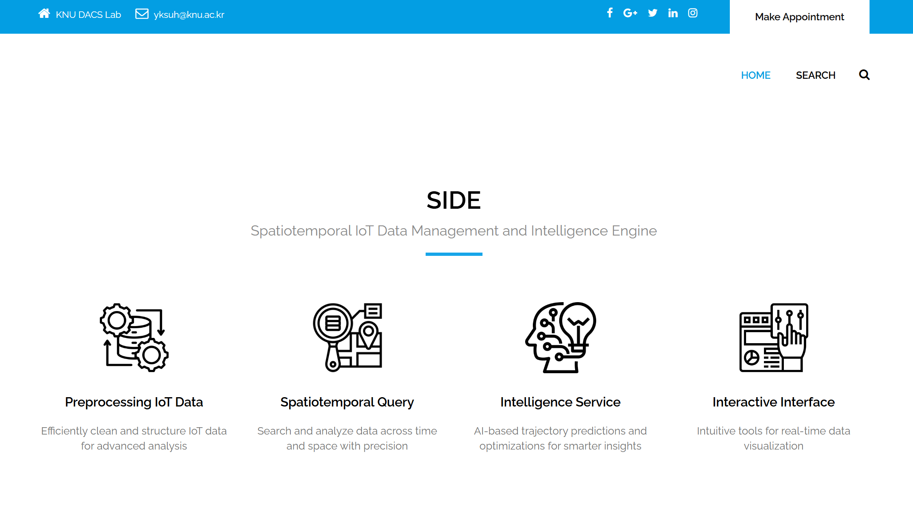
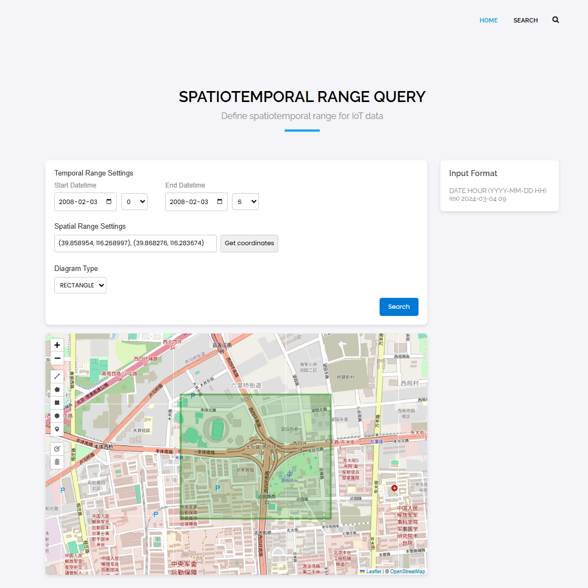
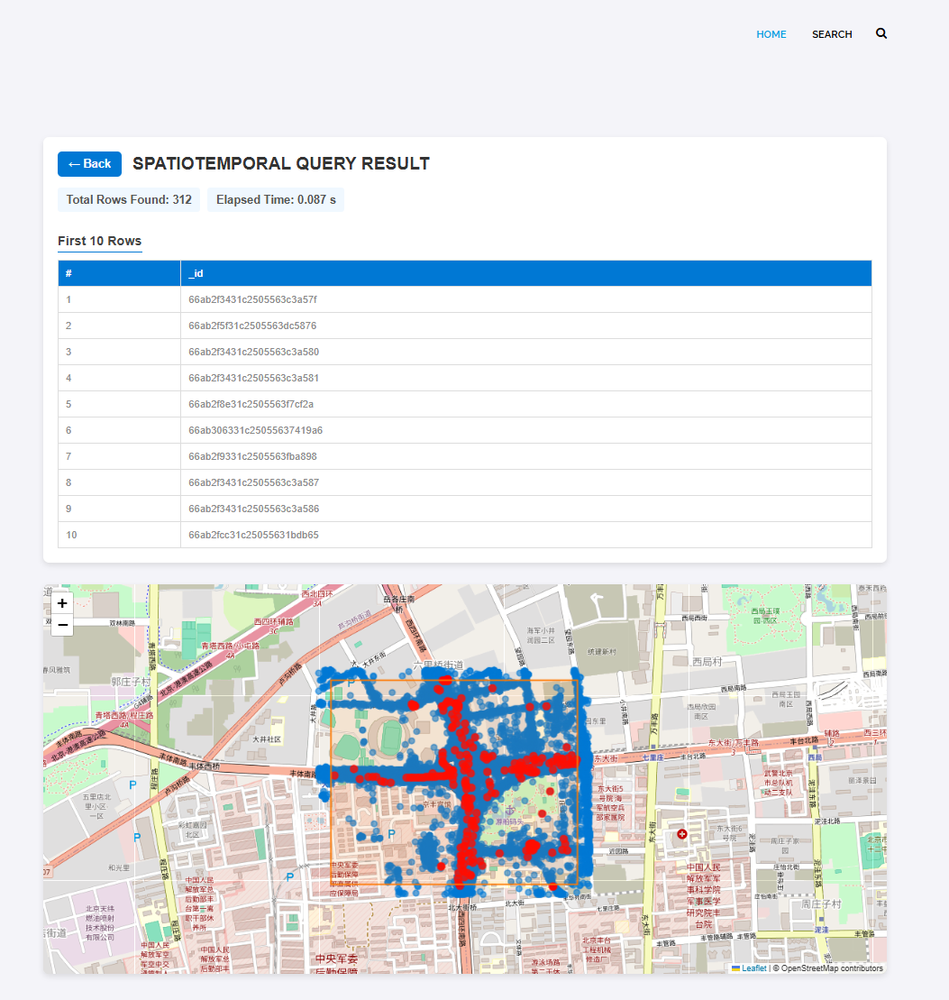

# SIDE: High-performance Spatiotemporal IoT Data Retrieval Engine

A high-performance indexing and query engine for large-scale spatiotemporal IoT data.  
It supports real-time spatial-temporal range queries and provides a map-based web interface for intuitive exploration.

## 📘 1. Overview

This system consists of two main components:

- **Index Server**: Performs efficient spatiotemporal indexing and querying using a trie-based indexing technique.
- **Web UI Server**: Offers a user-friendly map-based interface for defining query ranges and viewing results.

> MongoDB is used as the default backend, but it can be adapted to other databases if needed.


## 🔧 2. Prerequisites

- GCC / Clang (C++17 or higher)
- Python 3.x
- MongoDB (local or remote)
- Bash (Linux/Mac) or WSL (Windows)

## 🗂️ 3. Directory Structure

```
SIDE/
├── Config/
│   ├── index.ini
│   └── web.ini
├── Index/
│   └── src/
│       └── TST.hpp   ← [You must manually place this file]
├── Web/
│   └── templates/, static/, ...
├── index.sh
├── web.sh
└── README.md
```

📥 You can download the required `TST.hpp` file at the following link: [TST Github](https://github.com/lab-paper-code/TST)

---

## ⚙️ 4. Getting Started

### 4.1 Clone the Repository

```bash
git clone https://github.com/lab-paper-code/SIDE.git
cd SIDE
```

### 4.2 Configuration
#### Index Server: `Config/index.ini`

```ini
[INDEX_SERVER]
IP =            ; Index Server IP
PORT =          ; Index Server Port

[DATABASE]
ID =            ; MongoDB user ID
PASSWD =        ; MongoDB password
IP =            ; MongoDB host (e.g., 127.0.0.1)
PORT =          ; MongoDB port (e.g., 27017)
DB =            ; Database name
COLLECTION =    ; Collection name
```

#### Web Server: `Config/web.ini`

```ini
[WEB_SERVER]
IP =            ; Index Server IP
PORT =          ; Index Server Port
VIEW = Korea
```

- `VIEW` defines the initial map center.  
- Supported options: `Korea`, `Japan`, `USA`, `China`, `India`.


### 4.3 Running
```bash
sh index.sh
sh web.sh
```

## 🌐 5. Web UI Interface

The Web UI provides an intuitive interface for querying and visualizing spatiotemporal data.  
Built with Leaflet.js, it allows users to visually define temporal and spatial ranges and explore results directly on a map.

### 5.1 Main Page




### 5.2 Search Page

#### 5.2.1 Query Input Page – Define Conditions
This page is used to **define the query conditions** before performing the search.

**Main Features:**

- **🕓 Temporal Range**:  
  Choose a start and end time (e.g., `YYYY-MM-DD HH`). Time granularity is selectable (year, month, day, etc.).
  
- **📍 Spatial Range**:  
  Draw regions directly on the map using:
  - `RECTANGLE` ✅ Supported
  - `CIRCLE` 🚧 *To be supported in a future update*
  - `POLYGON` 🚧 *To be supported in a future update*

- **🗂 Coordinate Auto-Fill**:  
  Coordinates from drawn regions are automatically populated in the input fields.

- **🧭 Map Interface**:  
  Built with Leaflet.js. Users can zoom, pan, and interact directly.


#### 5.2.2 Result Page – Visualizing Results

After submitting a query, this page displays the results in both visual and tabular formats.

**Main Features:**

- **📊 Summary Panel**:  
  - Total number of records returned  
  - Elapsed query time in seconds

- **📄 Result Table**:  
  - Displays up to the first 10 records  
  - Shows MongoDB `_id` values as sample keys

- **🗺 Spatial Overlay**:  
  - **🔴 Red dots**: Matched results  
  - **🔵 Blue dots**: Contextual full dataset


<p align="center">
  
  
</p>


## 📬 6. Contact
For questions, feedback, or bug reports:
📧 **dkelaboffice@gmail.com**